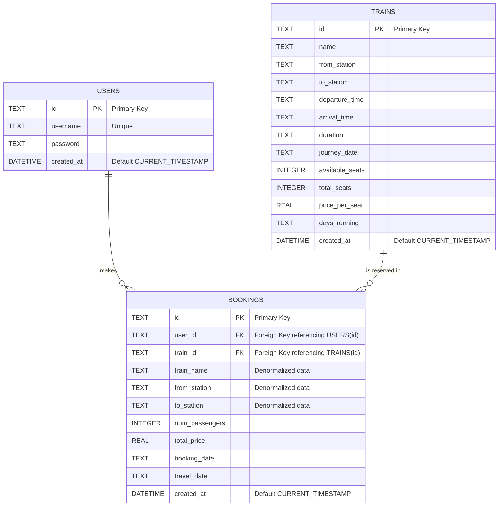
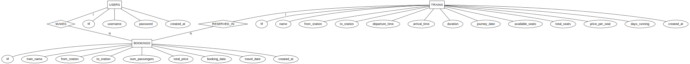

# Rail Connect - Train Booking Web Application

A full-stack, modern web application for searching and booking train tickets. This project demonstrates complete database design, integrity constraint enforcement, and full CRUD operations with a responsive React frontend, Express.js backend, and SQLite database.


---

## Problem Description and Assumptions

**Problem Description:** This project models an online train reservation system that allows users to search for trains between stations, view available seats, and book or cancel tickets. The system enforces real-world database design principles, ensuring real-time seat inventory management and maintaining strict data integrity across users, trains, and ticket bookings.

**Assumptions:**
1. **Payments:** Payment gateways are simulated; bookings are confirmed immediately upon requesting seats.
2. **Users:** A user must be registered to make a booking.
3. **Seat Allocation:** Seats are not specifically numbered in this system; the system tracks the aggregate count of available vs. booked seats.
4. **Cancellations:** A user can cancel a booking, which instantly restores the available seat count for that specific train.

---

## Conceptual Design (ER Modeling)

### 1. Crow's Foot Notation (Table-Focused)



### 2. Chen's Notation

---
*(Note regarding Weak Entities: No weak entities are present in this schema. All entities, including BOOKINGS, possess their own independent surrogate primary keys (`id`), making them strong entities.)*
## Relational Schema Mapping

* **USERS** (<u>id</u>, username, password, created_at)
* **TRAINS** (<u>id</u>, name, from_station, to_station, departure_time, arrival_time, duration, journey_date, available_seats, total_seats, price_per_seat, days_running, created_at)
* **BOOKINGS** (<u>id</u>, <i>user_id</i>, <i>train_id</i>, train_name, from_station, to_station, num_passengers, total_price, booking_date, travel_date, created_at)

*(Note: Underlined attributes indicate Primary Keys, italicized attributes indicate Foreign Keys).*

---

## Constraints Identification & Justification

**1. Domain Constraints**

* `available_seats` and `total_seats` (TRAINS): Must be `INTEGER`. *Justification:* You cannot book a fraction of a seat.
* `price_per_seat` and `total_price`: Must be `REAL` (Float). *Justification:* Currency requires decimal precision.
* `username` (USERS): Must be `TEXT` and cannot be empty. *Justification:* Required for user identification.

**2. Key Constraints**

* `id` in USERS, TRAINS, and BOOKINGS are `PRIMARY KEY`s. *Justification:* Uniquely identifies each record.
* `username` in USERS has a `UNIQUE` constraint. *Justification:* Two users cannot share the same login ID.

**3. Entity Integrity Constraints**

* All Primary Keys (`id`) have an implicit `NOT NULL` constraint. *Justification:* No entity can exist without a valid identifier.

**4. Referential Integrity Constraints**

* `user_id` in BOOKINGS references `id` in USERS. *Justification:* A ticket cannot be booked by a non-existent user.
* `train_id` in BOOKINGS references `id` in TRAINS. *Justification:* A ticket cannot be booked for a non-existent train.
* Both Foreign Keys are set to `NOT NULL`. *Justification:* Ensures every booking is strictly tied to both a user and a train (Total Participation).

**5. Additional Semantic (Business) Constraints**

* **Seat Availability Constraint:** The number of `available_seats` cannot drop below 0. Handled via backend application logic.
* **Booking Passenger Count:** `num_passengers` must be greater than 0.

---

## Features Implemented (Full CRUD)

### CREATE

* Book new train tickets via `/api/bookings`
* Register users and add new trains to the database.

### READ (Retrieve)

* Fetch all trains with dynamic station filters (`GET /api/trains?from=X&to=Y`).
* View comprehensive booking history per user.

### UPDATE

* Automatic seat count updates when a booking is made (seats decrease) or cancelled (seats restored).

### DELETE

* Cancel bookings and dynamically remove records from the database.

---
## Description of the Front-End Interface
The user interface is built with React and features a responsive, mobile-friendly design consisting of two primary views:
1. **Train Search & Booking Interface:** Users can select source and destination stations from dropdowns. The UI dynamically renders available trains as expandable cards showing departure times, duration, price, and a real-time count of available seats. Users can select passenger counts and trigger the booking workflow directly from the card.
2. **User Dashboard (My Bookings):** A dedicated view where users can retrieve their entire booking history. It displays aggregate statistics (total spent, tickets booked) and provides individual "Cancel Booking" buttons for instant data deletion and ticket refunds.
3. **Admin Login and Dashboard:** A dedicated view where admin can add or edit train details / capacity.
## Software Feats and Architechture

1. **Atomic Transaction Simulation:** When a booking is created, the system validates seat availability, creates the booking record, and deducts the available seats from the `trains` table in a strictly managed sequence. If one fails, the operation errors out, preventing overbooking.
2. **Real-time Data Synchronization:** The frontend instantly updates the UI state (available seats, booking lists) based on immediate database confirmations, acting as the single source of truth.
3. **Robust Error Handling:** Comprehensive try-catch blocks across all API calls, preventing server crashes and delivering user-friendly validation messages directly to the UI.
4. **SQL Security:** Heavy use of prepared statements and parameterized queries to completely mitigate SQL injection vulnerabilities.

---

## Technology Stack

* **Frontend:** React 19, TypeScript, Vite, CSS3 (Responsive Grid/Flexbox design)
* **Backend:** Node.js, Express.js (REST API framework), CORS enabled
* **Database:** Better SQLite (Modern Lightweight SQL database with persistent storage)

---

## Quick Start

1. **Install Dependencies:**
```bash
npm install        # Frontend
cd backend && npm install  # Backend

```


2. **Start Backend Server** (Terminal 1):
```bash
cd backend && npm start
# Runs on http://localhost:3001

```


3. **Start Frontend Server** (Terminal 2):
```bash
npm run dev
# App opens at http://localhost:5173
```

## Database Initialization & Sample Data
Upon first run, the SQLite database automatically initializes the relational tables and populates the `TRAINS` table with 5 representative sample train routes (e.g., Rajdhani Express, Shatabdi Express) across major cities with pre-configured seating and pricing data to allow for immediate testing.
